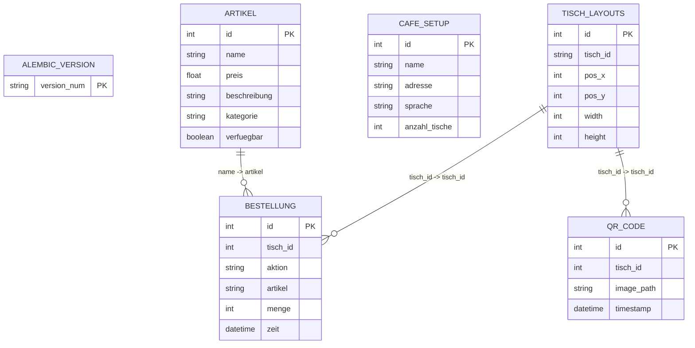

# projekt-softwareentwicklung

```mermaid
erDiagram
    ALEMBIC_VERSION {
        string version_num PK
    }

    ARTIKEL {
        int id PK
        string name
        float preis
        string beschreibung
        string kategorie
        boolean verfuegbar
    }

    BESTELLUNG {
        int id PK
        int tisch_id
        string aktion
        string artikel
        int menge
        datetime zeit
    }

    CAFE_SETUP {
        int id PK
        string name
        string adresse
        string sprache
        int anzahl_tische
    }

    QR_CODE {
        int id PK
        int tisch_id
        string image_path
        datetime timestamp
    }

    TISCH_LAYOUTS {
        int id PK
        string tisch_id
        int pos_x
        int pos_y
        int width
        int height
    }

    %% Logische/fachliche Beziehungen (nicht als FK in SQLite definiert)
    ARTIKEL ||--o{ BESTELLUNG : "name -> artikel"
    TISCH_LAYOUTS ||--o{ BESTELLUNG : "tisch_id -> tisch_id"
    TISCH_LAYOUTS ||--o{ QR_CODE : "tisch_id -> tisch_id"
```